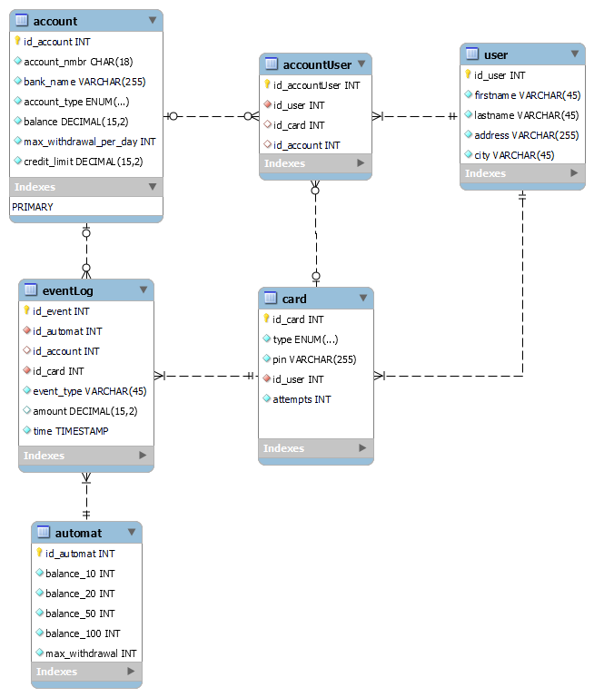

# Group_1 - bank_automat

**Tästä repositiosta löytyy OAMK tietotekniikan opiskelijoiden:**
- Ryhmä 1 - Syksy 2023 - bank_automat -projektin tiedostot

**Tekijät:**
- Juho Hietala
- Minna Leppänen
- Juha-Matti Huhta
- Rebecca Soisenniemi

# Pankkiautomaatin tietokannan ER-kaavio

# Ohjeet käyttöön

**Kun suoritat tämän demosovelluksen**
- Varmista, että tietokantayhteytesi on auki
- Käytä olemassa olevaa bank_automat -skeemaa ja sen testidataa
- Aja ne sisään manuaalisesti tai vaihtoehtoisesti docker-compose.yml:in avulla
- Luot tietokantaan käyttäjä atm_user ja anna luvat tietokantaan komennoilla:
	- **create user 'atm_user'@'localhost' identified by 'pankkipass';**
	- **grant all on bank_automat.* to 'atm_user'@'localhost';**
- Suorita **npm install** /backend -tasossa
- Luo JSON Web Token komentokehotteessa /backend tasossa komennolla: **node create_token**
- Luo **.env** tiedosto /backend tasoon ja aseta oma token ( .env -tiedostoon ) **MY_TOKEN** muuttujaan
- Suorita **npm start** /backend -tasossa

**Testidataa käyttäessäsi tarvitset seuraavat korttitiedot:**

**KORTTI   PIN    KORTIN TYYPPI**

  1    /  **9447**  /  _debit_                     
  2    /  **5860**  /  _debit_                        
  3    /  **1733**  /  _credit_                       
  4    /  **4322**  /  _debit_                        
  5    /  **8254**  /  _debit_                        
  6    /  **1998**  /  _debit_                        
  7    /  **3002**  /  _debit_                        
  8    /  **4105**  /  _debit_                        
  9    /  **4809**  /  _admin_                       
  10   /  **3944**  /  _credit_                       
  11   /  **4755**  /  _debit_                        
  12   /  **3226**  /  _debit_                        
  13   /  **6499**  /  _debit_                        
  14   /  **6877**  /  _debit_                        
  15   /  **2331**  /  _debit_                        
  16   /  **3422**  /  _credit/debit_   
  17   /  **1665**  /  _debit_                        
  18   /  **2942**  /  _debit_                        
  19   /  **2498**  /  _debit_                        
  20   /  **2452**  /  _admin_       
