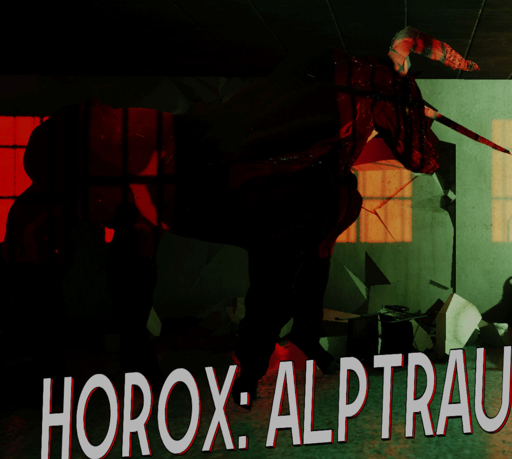

# Projektit

----------------------------------------------------------

## 2023-Q4-ATM-pankkiautomaatti

- Suloinen pankkiautomaattisimulaattori, jossa käyttäjä voi tilinsä varoihin ja tyyppiin perustuen esimerkiksi
  - Valita automaatin kartalta, _automaateilla on mm. erisuuruiset varat ja setelit sekä nostorajat._
  - Tarkastella tilinsä saldoa.
  - Selata tilitapahtumia.
  - Nostaa virtuaalirahaa, jos tilin saldo riittää nostoon ja automaatissa on sopivan suuruisia seteleitä nostoon.
  - Lisäksi simulaattorissa on eri käyttäjätasot, _mm. admin pystyy muuttamaan automaattien nostorajoja sekä lisäämään niihin varoja haluaminaan seteleinä._
- Ohjelman käyttöliittymä Qt, palvelin Node.js, tietokanta MySql. 
- Robot Framework kävi mukana REST APIn testauksessa.
- Kts. video, missä esitellään projektia: https://www.youtube.com/watch?v=Lp9dV-Fh-a4

----------------------------------------------------------

## 2024-Q2-Leffaysi

- Yhteisöllinen elokuvasivusto leffaharrastajille.
- Palvelun käyttäjät voivat mm.
  - Hakea elokuvia ja sarjoja eri suodatuksilla (IMDB).
  - Arvostella elokuvia/sarjoja ja muuttaa tai poistaa arvosteluitaan.
  - Lisätä elokuvia/sarjoja suosikkilistalleen ja poistaa sieltä.
  - Luoda ryhmiä ja hallinnoida ryhmiä, liittyä ryhmiin ja chattailla niissä.
  - Muuttaa profiilinsa yksityisyysasetusta sekä sallitun sisällön määritystä.
  - Eri käyttäjätasoina _user_ ja _admin_ sekä adminille mm. hallinnointipaneeli. 
- Käyttöliittymä React Vite, palvelin Node.js, tietokanta PostgreSQL.
- Kts. esittelyvideo: https://www.youtube.com/watch?v=4ZlEyXCdmbE

----------------------------------------------------------

## 2024-Q2Q3-LittleBit

- Unreal Enginellä tehty puzzle peli, jossa 16 toiminnallista tehtävää sekä easter egginä ankkojen etsimistä.
  - Kaunis visuaalinen toteutus, kartooninen ja pehmeä tyylittely 48:lla värillä.
  - Tarinallisuus tuotu esiin animaatioilla pelin alussa ja lopussa.
  - Pelihahmolla liikutaan 3. persoonassa ja pelimaailma on selkeästi rajattu, mutta sisällöllinen.
  - Pelaaja voi valita, ohjaako hahmoa ohjaimella vai näppäimistön ja hiiren yhdistelmällä.
- Assetteina käytetty pääasiassa CC0 -lisensioitua materiaalia, osa pelin tekstuureista, malleista ja äänistä tehty itse.
- Pelin gitti &#x1F512;.
- Pelin exe on julkaistu itch.iossa: [LittleBit - itch.io](https://lejdi.itch.io/littlebit)

----------------------------------------------------------

## 2024-Q4-Kierttis

- Kierrätyssovellus perustuen somen roskalavaryhmiin. 
- Kierttiksen ominaisuuksia lyhyesti:
  - Käyttäjä voi julkaista tavaroita annettavaksi sekä hallinnoida julkaisujaan.
  - Käyttäjä voi listautua jonoon / varaajaksi tuotteeseen sekä poistaa varauksiaan.
  - Julkaisija ja käyttäjä näkee jonottajien määrän tuotteessa sekä jonottaja saa jonotussijansa.
  - Jonotus etenee ja pinosta vanhentuneet varaukset poistuvat, _varaus on voimassa edellisen sijan päättymisestä 6h._
  - Ilmoitus on voimassa kunnes julkaisija merkitsee tuotteen luovutetuksi / poistaa sen, ja silti enintään viikon verran julkaisusta.
  - Julkaisijan ja 1. sijalla olevan varaajan välille avataan viestiketju, jossa he voivat sopia tuotteen luovutuksesta.
  - Viestiketjut lähtevät vanhentuneiden ja peruuntuneiden varausten mukana.
- Android-toteutus React nativella.
- Tietokannaksi valikoitui Firestore ja autentikointi Firebasea käyttäen.

----------------------------------------------------------

## 2025-Q1-CozyHouseTour

- Peliprojekti, jossa lisään vähitellen komponentteja projektipohjaan ja kokeilen samalla, kuinka Sweet Home 3D soveltuu talomallien paketointiin ja tuomiseen mukaan Unreal Engineen. 
- Pelillisiä toiminnallisuuksia jätetty pois (_esim. tarina, questit_) sillä halusin tehdä tällaisen yksinkertaisen kävelysimulaattorin, missä aloitan asetuksien tuomisesta.
  - Varhainen julkaisu ja mukaan on onnistuneesti saatu tässä vaiheessa yksi talomalli.
- Pelistä ei ole vielä asennusohjelmaa. Peli löytyy ladattavana .exenä itch.iosta: [Cozy House Tour](https://lejdi.itch.io/cozy-house-tour)
- Tässä vaiheessa rakennettu jo mm.
  - Audio asetukset, joissa säädöt äänille: Master, Music, SFX ja Ambient
  - Peliasetukset, joissa säädöt asetuksille: Invert mouse, Mouse sensitivity, Field of View, Motion blur, Show / Hide HUD
  - Grafiikka-asetuket, joissa säädöt: Window mode (_fullscreen, borderless, windowed_), Resolution (_many_), Scalability (_low, medium, high, epic_)
  - Asetusten asettaminen (Apply) ja asetusten palauttaminen (Set to defaults)
  - Responsiiviset widgetit skaalautuvat dynaamisesti eri resoluutioiden välillä
  - Käyttäjän määrittämät asetukset säilyvät pelissä ja istunnoissa

----------------------------------------------------------

## 2025-Q2-Q3-HoroxAlptraum

- Peliprojekti, jonka genrenä psykologinen kauhu 
  - Monta tapaa voittaa ja hävitä peli.
  - Peliin on tehty randomointia eri elementteihin ja tapahtumiin, mikä tuo uudelleenpelattavuutta.
  - Pelikokemus on erittäin immersiivinen.
- Toteutin tässä yhteistyöprojektissa seuraavia rooleja ja asioita
  - Techlead (DevOps) 
    - Dokumentoin kaiken, mitä tein sekä muodostin samalla projektille Qitlab-wikiä.
    - Autoin tiimiläisiä gitin haasteiden kanssa, mm. rebasen käytön hallintaa ja koodillisten konfliktien ratkaisemista.
    - Suunnittelin sekä toteutin pelille pohjan ja päälle monipuolisen interaktio-järjestelmän, johon lähes kaikki tehtävät & keräilyt pelissä nojaavat.
    - Toteutin peliin laadukkaat ja kattavat asetukset, joiden avulla pelaaja voi vaikuttaa pelikokemukseensa tottumustensa tai tietokoneensa tehon puitteissa.
    - Huomioin suorituskyvykkyydestä koko projektin etenemisen ajan, jotta kone ei hyytyisi.
    - Toin DevOps -henkeä mukaan projektiin & tein toistettavasti välttäen turhaa toistoa koodillisissa rakenteissa.
    - Tein buildit ja järjestin jakelut.
    - Tein Qt:lla Launcherin, joka lataa pelin asennusohjelman sekä suorittaa asennuksen käyttäjäystävällisesti.
  - Harjoittelin lisää 3D mallintamista ja animointia.
- Kaikkiaan mielenkiintoinen projekti, jossa opin paljon uutta sekä jatkoin laatuun tähtäävää työskentelyäni, mikä korostuu myös aiemmissa projekteissani.

----------------------------------------------------------

## Pelimekaniikkaa uudelleenkäytettävästi

- Toteutan omaa arkistoa, mikä sisältää uudelleenkäytettäviä mekaniikkaa & komponentteja omiin peliprojekteihin.
  - Tämä nopeuttaa ja sujuvoittaa pelien tekemistä huomattavasti. 
- Tarkoituksena on luoda hyvät pohjat asetuksista lähtien ja näin saada tuotettua laadukkaita indie-pelejä.
- Niiden ohella tavoitteenani on tutustua lisää pelin ja sen lisäosien julkaisu- ja päivitysprosesseihin.
